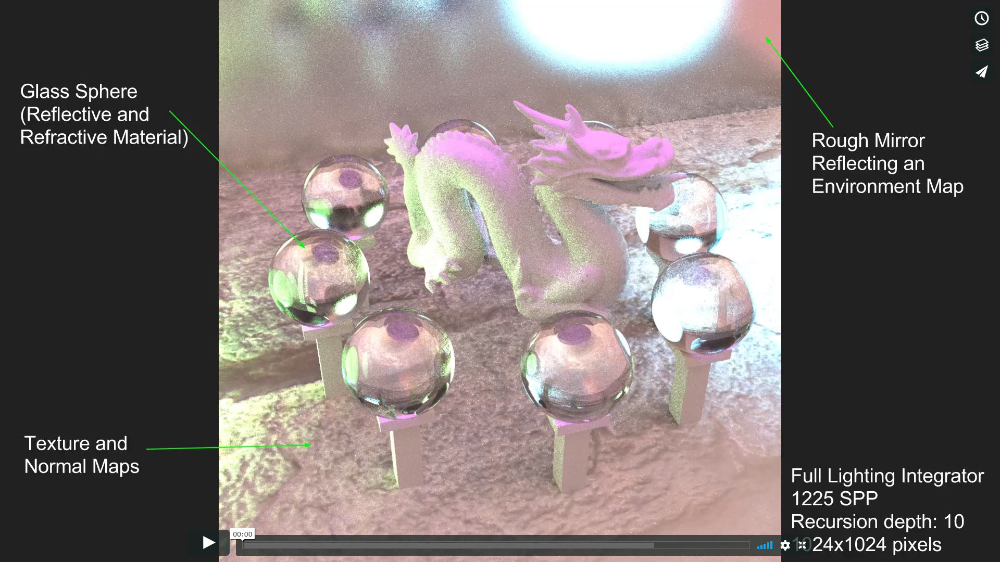

CPU Monte Carlo Path Tracer
===========================

* Name: Aman Sachan
* Built from scratch for CIS 561: Advanced Computer Graphics at the Universoty of Pennsylvania

------------
#README

##INTRODUCTION
  
  Monte Carlo Path tracing is a rendering technique that aims to represent global illumination as accurately as possible with respect to reality. The algorithm does this by approximating the integral over all the illuminance arriving at a point in the scene. A portion of this illuminance will go towards the viewpoint camera, and this portion of illuminance is determined by a surface reflectance function (BRDF). This integration procedure is repeated for every pixel in the output image. When combined with physically accurate models of surfaces, accurate models light sources, and optically-correct cameras, path tracing can produce still images that are indistinguishable from photographs.

  Path tracing naturally simulates many effects that have to be added as special cases for other methods (such as ray tracing or scanline rendering); these effects include soft shadows, depth of field, motion blur, caustics, ambient occlusion, and indirect lighting, etc.

  Due to its accuracy and unbiased nature, path tracing is used to generate reference images when testing the quality of other rendering algorithms. In order to get high quality images from path tracing, a large number of rays must be traced to avoid visible noisy artifacts.

## Features Implemented:

### Full Lighting Integrator
### Volumetric Integrator
### Direct Lighting Integrator
### Naive Lighting Integrator
### Multiple Important Sampling
### Bounding Volume Hierarchy
### Multi Threading
### Complex Implicit Surfaces
### Thin Lens Camera Model
### Various Lights
### Various BSDFs
#### Microfacet Model
### Russian Roullete Termination
### Sampling Techniques
### Intersection Testing with various primitives

## Pretty Renders:
